# wasm-python-fastapi

## python仮想環境の有効化
```
. .venv/bin/activate
```

## 
- https://docs.astral.sh/uv/guides/integration/fastapi/#deployment

## fastapiサーバ起動

```
uv run fastapi dev
```

## wasm生成
- [PythonのコードをWebAssemblyにコンパイルする「py2wasm」、Wasmerが発表](https://www.publickey1.jp/blog/24/pythonwebassemblypy2wasmwasmer.html)

```
sudo apt-get update
sudo apt-get install python3-dev
py2wasm main.py -o main.wasm
```

## py2wasm実行時のエラー
### libpythonが足りない件

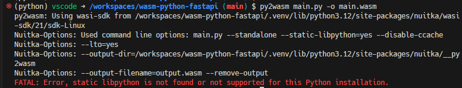

- https://zenn.dev/pinto0309/scraps/2fce2c824efa95 
- https://github.com/wasmerio/py2wasm?tab=readme-ov-file#nuitka-user-manual

> Nuitka is the Python compiler. It is written in Python. It is a seamless replacement or extension to the Python interpreter and compiles every construct that Python 2 (2.6, 2.7) and Python 3 (3.4 - 3.11) have, when itself run with that Python version.

より、python3.11でないと動かないらしいので、3.12から3.11に変更

```diff
diff --git a/.devcontainer/Dockerfile b/.devcontainer/Dockerfile
index 90b8c18..73ae5b9 100644
--- a/.devcontainer/Dockerfile
+++ b/.devcontainer/Dockerfile
@@ -1,5 +1,5 @@
 -ARG VARIANT=3-bullseye
+ARG VARIANT=3.11-bullseye
 FROM mcr.microsoft.com/vscode/devcontainers/python:${VARIANT}
```

### patchelfが足りない件

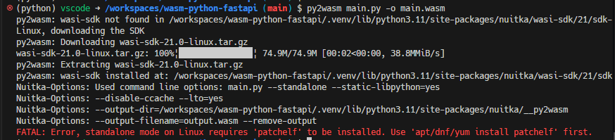

- 足りないライブラリがあるらしいので、OSに追加インストールする必要があった

```
sudo apt-get update
sudo apt-get install patchelf
```

### py2wasmの実行に時間が掛かる件
- この状態で5分以上止まっている

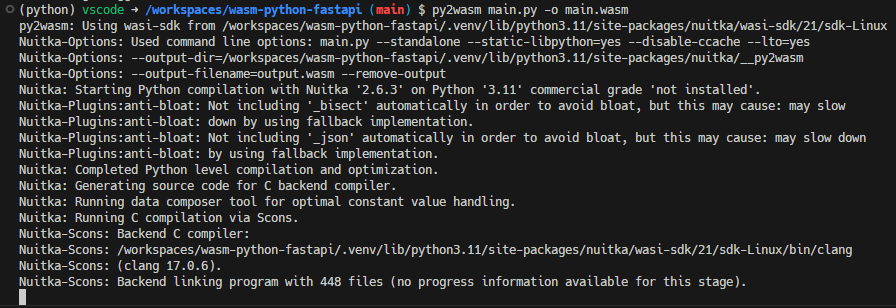

- wasmファイルが出力されるまで10分くらいは掛かった
- 2回目以降のpy2wasm実行で省略される部分があるかと期待したものの、そうではなさそうだった
  - wasm出力に毎回15分くらい待たされるのはかなりストレスかもしれない
  - wasm出力をGithub ActionsのCDスクリプトで行う場合、実行時間をかなり取られることになり、コスト増が懸念点となるかもしれないと感じた

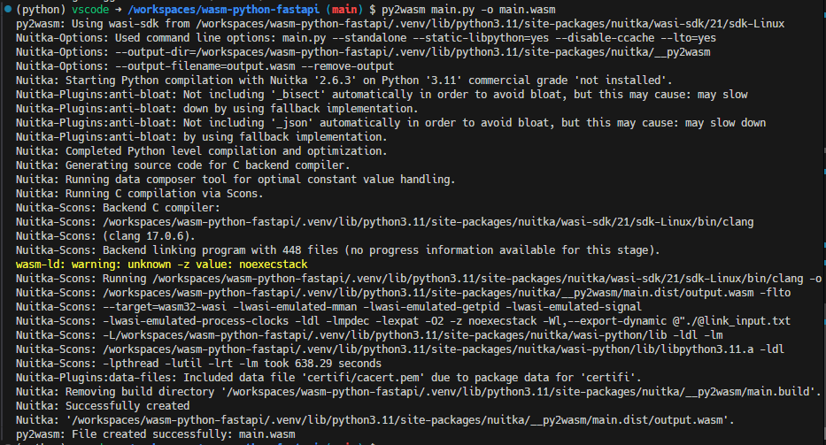

### これで無事wasmファイルが出力された
- ファイルサイズは77MB
- 想像よりは大きかったがコンテナイメージと比較するとかなり小さい

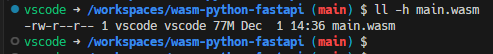

## wasmファイルをローカルで実行する

### wasmtimeで実行してみる -> textwrapの制約
- [devcontainer features](https://containers.dev/features)にあったので`devcontainer.json`に追記してwasmtimeを使ってみた

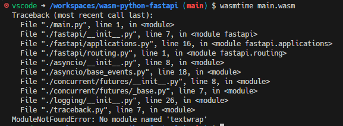

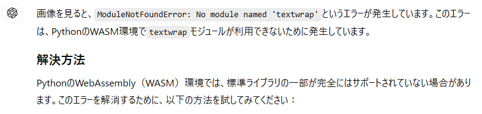


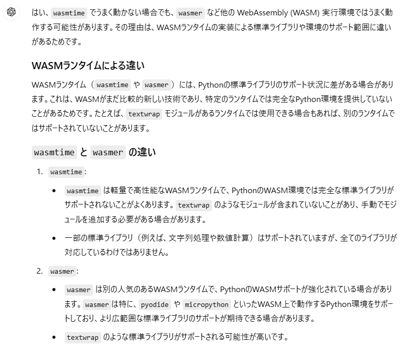

### wasmerを使ってみる
- microsoftのdevcontainer向けdocker imageで`python:3.11-bullseye`を採用しており、`glibc`のバージョンが`2.31`だったことがwasmerインストールの障害となった

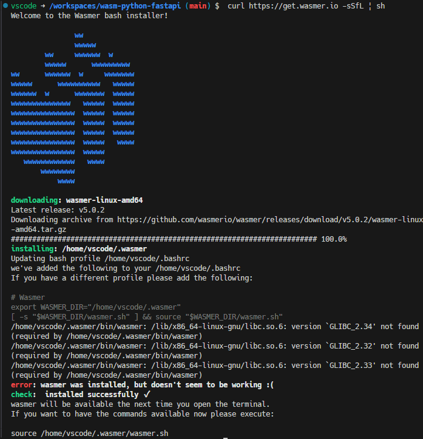

- `Dockerfile`のFROMを`python:3.11-bookworm`に変更することで`glibc`が`2.36`となった

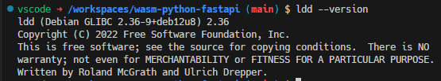

```
curl https://get.wasmer.io -sSfL | sh
```

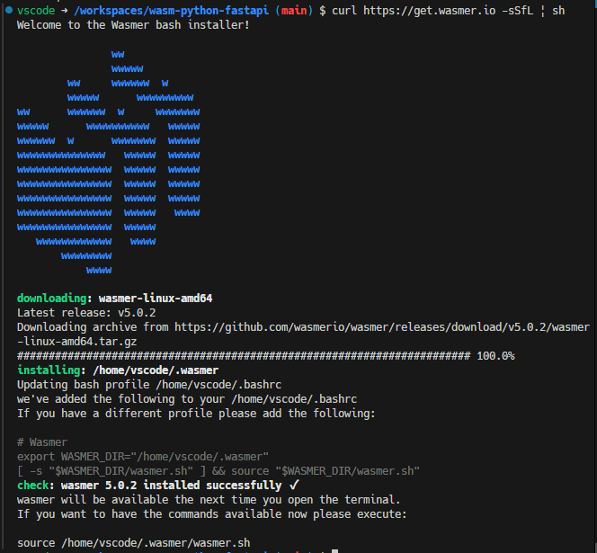

- 無事、wasmerがインストールできた

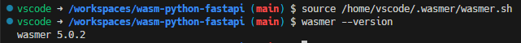

- wasmerでwasmファイルを実行したが、wasmtimeと同様textwrapで引っかかった

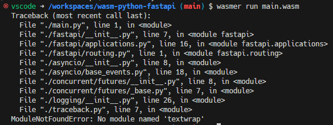