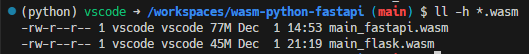

# wasm-python-fastapi

## python仮想環境の有効化
```
. .venv/bin/activate
```

## 
- https://docs.astral.sh/uv/guides/integration/fastapi/#deployment

## fastapiサーバ起動

```
uv run fastapi dev
```

## wasm生成
- [PythonのコードをWebAssemblyにコンパイルする「py2wasm」、Wasmerが発表](https://www.publickey1.jp/blog/24/pythonwebassemblypy2wasmwasmer.html)

```
py2wasm main.py -o main.wasm
```

## py2wasm実行時のエラー
### libpythonが足りない件


- https://zenn.dev/pinto0309/scraps/2fce2c824efa95 
- https://github.com/wasmerio/py2wasm?tab=readme-ov-file#nuitka-user-manual

> Nuitka is the Python compiler. It is written in Python. It is a seamless replacement or extension to the Python interpreter and compiles every construct that Python 2 (2.6, 2.7) and Python 3 (3.4 - 3.11) have, when itself run with that Python version.

より、python3.11でないと動かないらしいので、3.12から3.11に変更

```diff
diff --git a/.devcontainer/Dockerfile b/.devcontainer/Dockerfile
index 90b8c18..73ae5b9 100644
--- a/.devcontainer/Dockerfile
+++ b/.devcontainer/Dockerfile
@@ -1,5 +1,5 @@
 -ARG VARIANT=3-bullseye
+ARG VARIANT=3.11-bullseye
 FROM mcr.microsoft.com/vscode/devcontainers/python:${VARIANT}
```

### patchelfが足りない件


- 足りないライブラリがあるらしいので、OSに追加インストールする必要があった

```
sudo apt-get update
sudo apt-get install patchelf
```

### py2wasmの実行に時間が掛かる件
- この状態で5分以上止まっている


- wasmファイルが出力されるまで10分くらいは掛かった
- 2回目以降のpy2wasm実行で省略される部分があるかと期待したものの、そうではなさそうだった
  - wasm出力に毎回15分くらい待たされるのはかなりストレスかもしれない
  - wasm出力をGithub ActionsのCDスクリプトで行う場合、実行時間をかなり取られることになり、コスト増が懸念点となるかもしれないと感じた


### これで無事wasmファイルが出力された
- ファイルサイズは77MB
- 想像よりは大きかったがコンテナイメージと比較するとかなり小さい


## wasmファイルをローカルで実行する

### wasmtimeで実行してみる -> textwrapの制約
- [devcontainer features](https://containers.dev/features)にあったので`devcontainer.json`に追記してwasmtimeを使ってみた


### wasmerを使ってみる
- microsoftのdevcontainer向けdocker imageで`python:3.11-bullseye`を採用しており、`glibc`のバージョンが`2.31`だったことがwasmerインストールの障害となった


- `Dockerfile`のFROMを`python:3.11-bookworm`に変更することで`glibc`が`2.36`となった


```
curl https://get.wasmer.io -sSfL | sh
```


- 無事、wasmerがインストールできた


- wasmerでwasmファイルを実行したが、wasmtimeと同様textwrapで引っかかった


## FastAPIではなくFlaskで試してみる
- FastAPIを使うとtextwrapモジュールがwasm実行時の制約になることが分かった
- Flaskで組んだ場合にどうなるかを試してみる

```py
from flask import Flask

app = Flask(__name__)


@app.route("/")
def hello_world():
    return "<p>Hello, World!</p>"
```

- py2wasmでwasmバイナリを作成
- Flask版wasmのサイズは45MBだった



### Flask + wasmerの場合
- 実行はできたものの`localhost:5000`をブラウザで開いてもローディングが終わらず

```
wasmer run main_flask.wasm
```

### Flask + wasmtimeの場合

```
wasmtime main_flask.wasm
```

- 以下のようなエラーログが出て実行できなかった

<details>
<summary>wasmtime実行時のコンソールログ</summary>

```
Error: failed to run main module `main_flask.wasm`

Caused by:
    0: failed to invoke command default
    1: error while executing at wasm backtrace:
           0: 0x15a55 - <unknown>!binary_op1
           1: 0x16b24 - <unknown>!PyNumber_InPlaceAdd
           2: 0x13b78a9 - <unknown>!_nuitka_loader_find_spec
           3: 0x80fa5 - <unknown>!cfunction_call
           4: 0x318e8 - <unknown>!_PyObject_MakeTpCall
           5: 0x32016 - <unknown>!PyObject_Vectorcall
           6: 0x129c61 - <unknown>!_PyEval_EvalFrameDefault
           7: 0x12baa4 - <unknown>!_PyEval_Vector
           8: 0x32491 - <unknown>!_PyFunction_Vectorcall
           9: 0x336c7 - <unknown>!object_vacall
          10: 0x3344a - <unknown>!PyObject_CallMethodObjArgs
          11: 0x165cb5 - <unknown>!PyImport_ImportModuleLevelObject
          12: 0x124deb - <unknown>!_PyEval_EvalFrameDefault
          13: 0x11e34b - <unknown>!PyEval_EvalCode
          14: 0x164986 - <unknown>!PyImport_ExecCodeModuleObject
          15: 0x164b54 - <unknown>!PyImport_ExecCodeModuleWithPathnames
          16: 0x164bd7 - <unknown>!PyImport_ExecCodeModuleEx
          17: 0x139b488 - <unknown>!_EXECUTE_EMBEDDED_MODULE
          18: 0x13b7cd4 - <unknown>!_nuitka_loader_exec_module
          19: 0x80fa5 - <unknown>!cfunction_call
          20: 0x318e8 - <unknown>!_PyObject_MakeTpCall
          21: 0x32016 - <unknown>!PyObject_Vectorcall
          22: 0x129c61 - <unknown>!_PyEval_EvalFrameDefault
          23: 0x12baa4 - <unknown>!_PyEval_Vector
          24: 0x32491 - <unknown>!_PyFunction_Vectorcall
          25: 0x336c7 - <unknown>!object_vacall
          26: 0x3344a - <unknown>!PyObject_CallMethodObjArgs
          27: 0x165cb5 - <unknown>!PyImport_ImportModuleLevelObject
          28: 0x124deb - <unknown>!_PyEval_EvalFrameDefault
          29: 0x11e34b - <unknown>!PyEval_EvalCode
          30: 0x164986 - <unknown>!PyImport_ExecCodeModuleObject
          31: 0x164b54 - <unknown>!PyImport_ExecCodeModuleWithPathnames
          32: 0x164bd7 - <unknown>!PyImport_ExecCodeModuleEx
          33: 0x139b488 - <unknown>!_EXECUTE_EMBEDDED_MODULE
          34: 0x13b7cd4 - <unknown>!_nuitka_loader_exec_module
          35: 0x80fa5 - <unknown>!cfunction_call
          36: 0x318e8 - <unknown>!_PyObject_MakeTpCall
          37: 0x32016 - <unknown>!PyObject_Vectorcall
          38: 0x129c61 - <unknown>!_PyEval_EvalFrameDefault
          39: 0x12baa4 - <unknown>!_PyEval_Vector
          40: 0x32491 - <unknown>!_PyFunction_Vectorcall
          41: 0x336c7 - <unknown>!object_vacall
          42: 0x3344a - <unknown>!PyObject_CallMethodObjArgs
          43: 0x165cb5 - <unknown>!PyImport_ImportModuleLevelObject
          44: 0x124deb - <unknown>!_PyEval_EvalFrameDefault
          45: 0x11e34b - <unknown>!PyEval_EvalCode
          46: 0x164986 - <unknown>!PyImport_ExecCodeModuleObject
          47: 0x164b54 - <unknown>!PyImport_ExecCodeModuleWithPathnames
          48: 0x164bd7 - <unknown>!PyImport_ExecCodeModuleEx
          49: 0x139b488 - <unknown>!_EXECUTE_EMBEDDED_MODULE
          50: 0x13b7cd4 - <unknown>!_nuitka_loader_exec_module
          51: 0x80fa5 - <unknown>!cfunction_call
          52: 0x318e8 - <unknown>!_PyObject_MakeTpCall
          53: 0x32016 - <unknown>!PyObject_Vectorcall
          54: 0x129c61 - <unknown>!_PyEval_EvalFrameDefault
          55: 0x12baa4 - <unknown>!_PyEval_Vector
          56: 0x32491 - <unknown>!_PyFunction_Vectorcall
          57: 0x336c7 - <unknown>!object_vacall
          58: 0x3344a - <unknown>!PyObject_CallMethodObjArgs
          59: 0x165cb5 - <unknown>!PyImport_ImportModuleLevelObject
          60: 0x119d63 - <unknown>!builtin___import__
          61: 0x80736 - <unknown>!cfunction_vectorcall_FASTCALL_KEYWORDS
          62: 0x31ece - <unknown>!_PyVectorcall_Call
          63: 0x31e77 - <unknown>!PyVectorcall_Call
          64: 0x80f50 - <unknown>!cfunction_call
          65: 0x37538a - <unknown>!CALL_FUNCTION_WITH_ARGS5
          66: 0x389790 - <unknown>!IMPORT_MODULE5
          67: 0x125c05d - <unknown>!modulecode_werkzeug$serving
          68: 0x139b4e1 - <unknown>!_EXECUTE_EMBEDDED_MODULE
          69: 0x13b7cd4 - <unknown>!_nuitka_loader_exec_module
          70: 0x80fa5 - <unknown>!cfunction_call
          71: 0x318e8 - <unknown>!_PyObject_MakeTpCall
          72: 0x32016 - <unknown>!PyObject_Vectorcall
          73: 0x129c61 - <unknown>!_PyEval_EvalFrameDefault
          74: 0x12baa4 - <unknown>!_PyEval_Vector
          75: 0x32491 - <unknown>!_PyFunction_Vectorcall
          76: 0x336c7 - <unknown>!object_vacall
          77: 0x3344a - <unknown>!PyObject_CallMethodObjArgs
          78: 0x165cb5 - <unknown>!PyImport_ImportModuleLevelObject
          79: 0x119d63 - <unknown>!builtin___import__
          80: 0x80736 - <unknown>!cfunction_vectorcall_FASTCALL_KEYWORDS
          81: 0x31ece - <unknown>!_PyVectorcall_Call
          82: 0x31e77 - <unknown>!PyVectorcall_Call
          83: 0x80f50 - <unknown>!cfunction_call
          84: 0x37538a - <unknown>!CALL_FUNCTION_WITH_ARGS5
          85: 0x389790 - <unknown>!IMPORT_MODULE5
          86: 0xe50403 - <unknown>!modulecode_werkzeug
          87: 0x139b4e1 - <unknown>!_EXECUTE_EMBEDDED_MODULE
          88: 0x13b7cd4 - <unknown>!_nuitka_loader_exec_module
          89: 0x80fa5 - <unknown>!cfunction_call
          90: 0x318e8 - <unknown>!_PyObject_MakeTpCall
          91: 0x32016 - <unknown>!PyObject_Vectorcall
          92: 0x129c61 - <unknown>!_PyEval_EvalFrameDefault
          93: 0x12baa4 - <unknown>!_PyEval_Vector
          94: 0x32491 - <unknown>!_PyFunction_Vectorcall
          95: 0x336c7 - <unknown>!object_vacall
          96: 0x3344a - <unknown>!PyObject_CallMethodObjArgs
          97: 0x165cb5 - <unknown>!PyImport_ImportModuleLevelObject
          98: 0x119d63 - <unknown>!builtin___import__
          99: 0x80736 - <unknown>!cfunction_vectorcall_FASTCALL_KEYWORDS
         100: 0x31ece - <unknown>!_PyVectorcall_Call
         101: 0x3223c - <unknown>!_PyObject_Call
         102: 0x322fc - <unknown>!PyObject_Call
         103: 0x129777 - <unknown>!_PyEval_EvalFrameDefault
         104: 0x12baa4 - <unknown>!_PyEval_Vector
         105: 0x32491 - <unknown>!_PyFunction_Vectorcall
         106: 0x336c7 - <unknown>!object_vacall
         107: 0x3344a - <unknown>!PyObject_CallMethodObjArgs
         108: 0x165cb5 - <unknown>!PyImport_ImportModuleLevelObject
         109: 0x119d63 - <unknown>!builtin___import__
         110: 0x80736 - <unknown>!cfunction_vectorcall_FASTCALL_KEYWORDS
         111: 0x31ece - <unknown>!_PyVectorcall_Call
         112: 0x31e77 - <unknown>!PyVectorcall_Call
         113: 0x80f50 - <unknown>!cfunction_call
         114: 0x37538a - <unknown>!CALL_FUNCTION_WITH_ARGS5
         115: 0x7bf629 - <unknown>!modulecode_flask$globals
         116: 0x139b4e1 - <unknown>!_EXECUTE_EMBEDDED_MODULE
         117: 0x13b7cd4 - <unknown>!_nuitka_loader_exec_module
         118: 0x80fa5 - <unknown>!cfunction_call
         119: 0x318e8 - <unknown>!_PyObject_MakeTpCall
         120: 0x32016 - <unknown>!PyObject_Vectorcall
         121: 0x129c61 - <unknown>!_PyEval_EvalFrameDefault
         122: 0x12baa4 - <unknown>!_PyEval_Vector
         123: 0x32491 - <unknown>!_PyFunction_Vectorcall
         124: 0x336c7 - <unknown>!object_vacall
         125: 0x3344a - <unknown>!PyObject_CallMethodObjArgs
         126: 0x165cb5 - <unknown>!PyImport_ImportModuleLevelObject
         127: 0x119d63 - <unknown>!builtin___import__
         128: 0x80736 - <unknown>!cfunction_vectorcall_FASTCALL_KEYWORDS
         129: 0x31ece - <unknown>!_PyVectorcall_Call
         130: 0x31e77 - <unknown>!PyVectorcall_Call
         131: 0x80f50 - <unknown>!cfunction_call
         132: 0x37538a - <unknown>!CALL_FUNCTION_WITH_ARGS5
         133: 0x389790 - <unknown>!IMPORT_MODULE5
         134: 0x7d64c6 - <unknown>!modulecode_flask$json
         135: 0x139b4e1 - <unknown>!_EXECUTE_EMBEDDED_MODULE
         136: 0x13b7cd4 - <unknown>!_nuitka_loader_exec_module
         137: 0x80fa5 - <unknown>!cfunction_call
         138: 0x318e8 - <unknown>!_PyObject_MakeTpCall
         139: 0x32016 - <unknown>!PyObject_Vectorcall
         140: 0x129c61 - <unknown>!_PyEval_EvalFrameDefault
         141: 0x12baa4 - <unknown>!_PyEval_Vector
         142: 0x32491 - <unknown>!_PyFunction_Vectorcall
         143: 0x336c7 - <unknown>!object_vacall
         144: 0x3344a - <unknown>!PyObject_CallMethodObjArgs
         145: 0x165cb5 - <unknown>!PyImport_ImportModuleLevelObject
         146: 0x119d63 - <unknown>!builtin___import__
         147: 0x80736 - <unknown>!cfunction_vectorcall_FASTCALL_KEYWORDS
         148: 0x31ece - <unknown>!_PyVectorcall_Call
         149: 0x3223c - <unknown>!_PyObject_Call
         150: 0x322fc - <unknown>!PyObject_Call
         151: 0x129777 - <unknown>!_PyEval_EvalFrameDefault
         152: 0x12baa4 - <unknown>!_PyEval_Vector
         153: 0x32491 - <unknown>!_PyFunction_Vectorcall
         154: 0x336c7 - <unknown>!object_vacall
         155: 0x3344a - <unknown>!PyObject_CallMethodObjArgs
         156: 0x166000 - <unknown>!PyImport_ImportModuleLevelObject
         157: 0x119d63 - <unknown>!builtin___import__
         158: 0x80736 - <unknown>!cfunction_vectorcall_FASTCALL_KEYWORDS
         159: 0x31ece - <unknown>!_PyVectorcall_Call
         160: 0x31e77 - <unknown>!PyVectorcall_Call
         161: 0x80f50 - <unknown>!cfunction_call
         162: 0x37538a - <unknown>!CALL_FUNCTION_WITH_ARGS5
         163: 0x389790 - <unknown>!IMPORT_MODULE5
         164: 0x72c151 - <unknown>!modulecode_flask
         165: 0x139b4e1 - <unknown>!_EXECUTE_EMBEDDED_MODULE
         166: 0x13b7cd4 - <unknown>!_nuitka_loader_exec_module
         167: 0x80fa5 - <unknown>!cfunction_call
         168: 0x318e8 - <unknown>!_PyObject_MakeTpCall
         169: 0x32016 - <unknown>!PyObject_Vectorcall
         170: 0x129c61 - <unknown>!_PyEval_EvalFrameDefault
         171: 0x12baa4 - <unknown>!_PyEval_Vector
         172: 0x32491 - <unknown>!_PyFunction_Vectorcall
         173: 0x336c7 - <unknown>!object_vacall
         174: 0x3344a - <unknown>!PyObject_CallMethodObjArgs
         175: 0x165cb5 - <unknown>!PyImport_ImportModuleLevelObject
         176: 0x119d63 - <unknown>!builtin___import__
         177: 0x80736 - <unknown>!cfunction_vectorcall_FASTCALL_KEYWORDS
         178: 0x31ece - <unknown>!_PyVectorcall_Call
         179: 0x31e77 - <unknown>!PyVectorcall_Call
         180: 0x80f50 - <unknown>!cfunction_call
         181: 0x37538a - <unknown>!CALL_FUNCTION_WITH_ARGS5
         182: 0x372a74 - <unknown>!modulecode___main__
         183: 0x139b4e1 - <unknown>!_EXECUTE_EMBEDDED_MODULE
         184: 0x139ac3d - <unknown>!EXECUTE_MAIN_MODULE
         185: 0x1399c5f - <unknown>!main
         186: 0x344330 - <unknown>!__main_void
         187: 0x12ba5 - <unknown>!_start
       note: using the `WASMTIME_BACKTRACE_DETAILS=1` environment variable may show more debugging information
    2: wasm trap: indirect call type mismatch
```

</details>